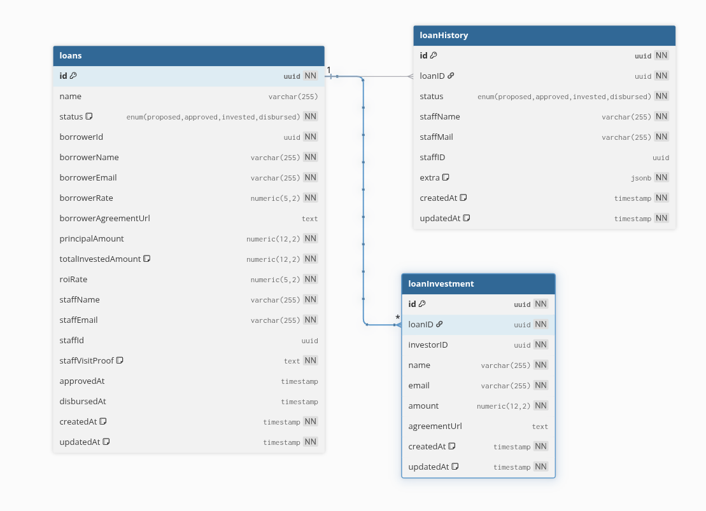

### ABET

ABET is an abbreviation for 'Amartha Backend Test'. This repository contains the implementation of the task given to me via my email. Details of how I do this task is explained clearly below:

- Install all dependencies

```
go mod tidy
```

- Install goose migration

```
go install github.com/pressly/goose/v3/cmd/goose@latest
```

- Copy ```.env.example``` to ```.env``` and adjust with your machine / cloud environment

```
cp .env.example .env
```

- Run schema migration

```
make migrate
```

- (Optional) if migrated schema doesn't satisfy you (e.g., you want to add/reduce column, creating additional index, etc), rollback the migration

```
make migrate-back
```

- Run

```
make run
```

Or,

```
go run cmd/rest/main.go
```

- (Optional) Build the binary to reduce initial execution time, then run

```
shell> make build
shell> ./app.backend
```

- (Optional) run the unit test (with coverage of course)

```
shell> make test-cover
```

### Entity Relationship Diagram

